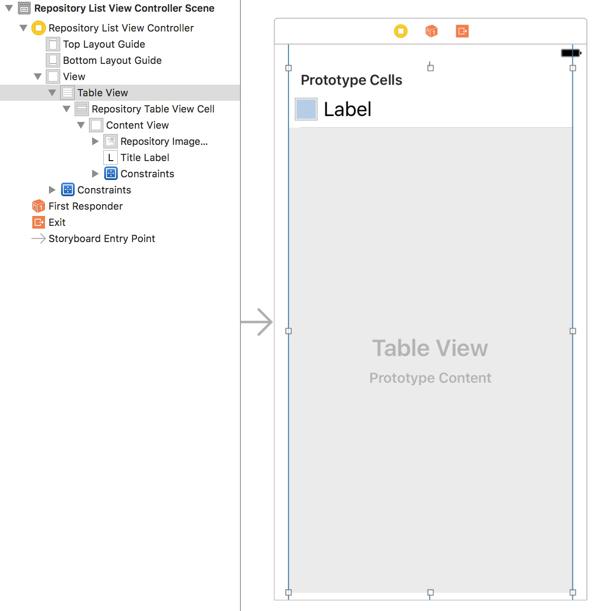
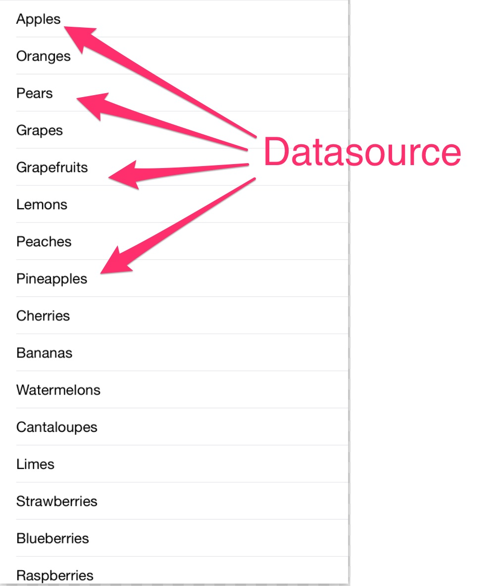

autoscale: true
# Protocols, Delegates, Datasources... oh and UITableView

---

## Protocols

---

### Examples

#### From the Swift Standard Library

## Can do

`Equatable`
`Comparable`
`RawRepresentable`

---

## Is a 

`CollectionType`
`ErrorType`
`SequenceType`

## Can be 

`CustomStringConvertible`

---

### UITableView



#### Steps to set up UITableView (not necessarily in order)

- Add UITableView to ViewController
- Add a prototype cell and customize it
- Create custom UITableViewCell subclass (don't forget to set it in identity inspector)
- Set delegate and datasource to ViewController
- Conform the UITableViewController to `UITableViewDataSource` and `UITableViewDelegate`

---

## DataSources and Delegates

- UITableViewDataSource
- UITableViewDelegate
- UIPickerViewDataSource
- UIPickerViewDelegate

---

## UITableViewDataSource



```
var fruits = [
	"Apples",
	"Oranges",
	"Pears",
	...
]

func tableView(
  _ tableView: UITableView,
  cellForRowAt indexPath: IndexPath
) -> UITableViewCell {
  
  // Customize and return cell
}

func tableView(
   _ tableView: UITableView,
   numberOfRowsInSection section: Int
) -> Int {

  // Return number of cells
}
```

## UITableViewDelegate

... some highlights from the documentation

---

## UIPickerViewDataSource


```
var cities = [
	"Mountain View",
	"Sunnyvale",
	"Cupertino",
	"Santa Clara",
	...
]

func numberOfComponents(in: UIPickerView)

func pickerView(UIPickerView, numberOfRowsInComponent: Int)

```

## UIPickerViewDelegate

... again, lets quickly go to the documentation

---


### Demo

---

## Challenge (in no particular order)

- Add stars, forks, watching to list with fake data
- Add a second UITableView with a list of videos. Use a Tab Bar Controller to go between the two
- Handle selection of repository to a detail view
- Add a search bar to search by name
- Add a subtitle label to cell to show a short description